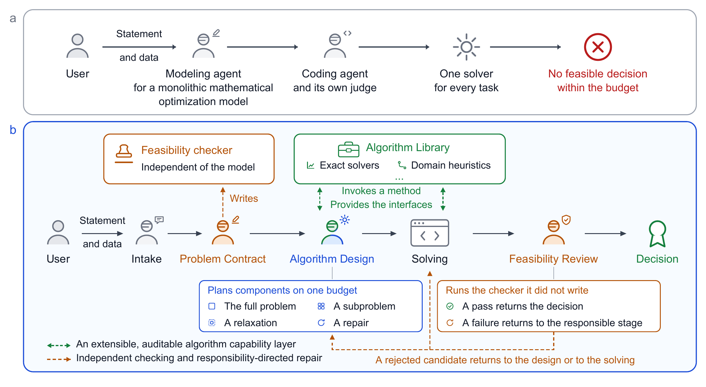
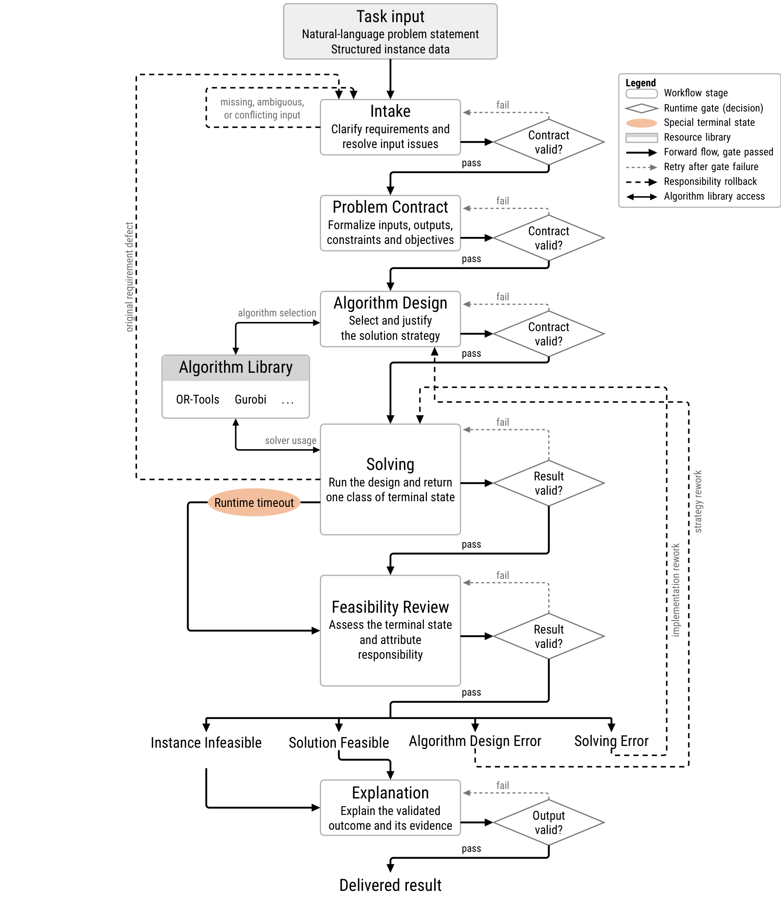
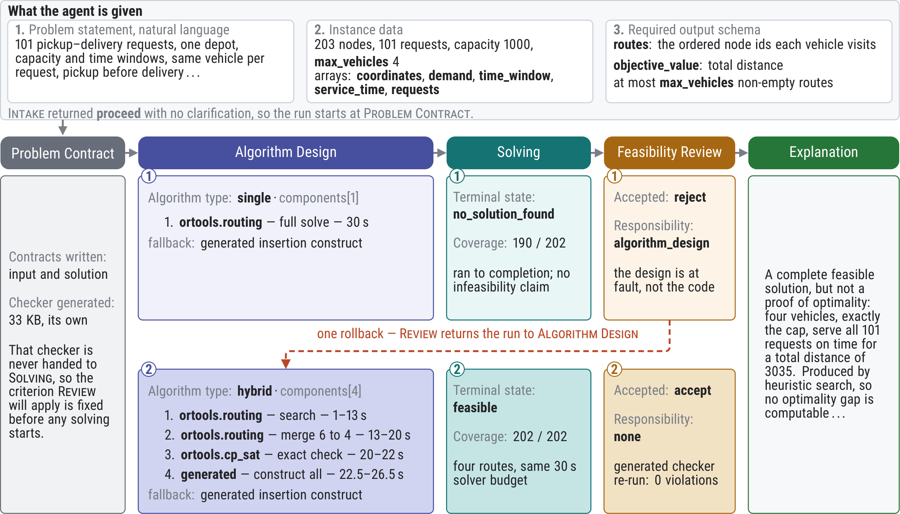

# DecisionBrain

DecisionBrain is an optimization agent for natural-language operations-research problems that
does not require a single monolithic mathematical model. It designs instance-dependent
strategies by composing validated general-purpose and domain-specific methods, records which
interfaces actually run through an auditable capability layer, and independently checks each
candidate with a task- and instance-specific feasibility checker that routes failures to the
stage responsible for targeted repair.

## System Overview



DecisionBrain replaces a model-first route with strategy-level design over components,
validated heterogeneous methods, and independent feasibility review.

## Pluggable Algorithm Library

Extending DecisionBrain is a catalog operation, not a code change. Every method the Agent can
reach is declared in one strict YAML manifest under `algorithms/manifests/`, and the Agent reads
that catalog at run time. Adding a solver, a metaheuristic framework, or an in-house domain
routine means adding one manifest. Nothing in `src/decisionbrain/` is touched, and no stage
prompt is rewritten.

```bash
# Plug a package in; the Agent sees it on the next run.
dbn algorithms add path/to/package.yaml

# Also run the declared import and minimal-call checks before the catalog is updated.
dbn algorithms add path/to/package.yaml --check-runtime

# Overwrite an entry that already uses the same package ID.
dbn algorithms add path/to/package.yaml --replace

# Inspect the catalog: package ID, verified version, status.
dbn algorithms list

# Unplug a package by removing its manifest from the catalog.
rm algorithms/manifests/<package-id>.yaml
```

The catalog directory is `algorithms/manifests/` by default and follows
`OPT_ALGORITHM_MANIFESTS_DIR` when it is set, so an evaluation machine can carry its own catalog
without editing the checkout. `dbn algorithms add` validates the manifest against the
package-specific interface profile, rejects a duplicate ID unless `--replace` is explicit,
installs the file atomically, and reloads the catalog.

The eight manifests shipped here are a starting catalog rather than a fixed one. They cover
Gurobi, OR-Tools, PySCIPOpt, RSOME, ALNS, PyVRP, PyJobShop, and JobShopLib, spanning exact
solvers, a robust-optimization modeling layer, metaheuristic frameworks, and domain-specific
routing and scheduling packages. A manifest records the problem families, the method class, the
optimality guarantee, the selection conditions, the limitations, and the verified distribution
version, so a new package becomes usable by Algorithm Design and Solving the moment it is
installed. See [Add an Algorithm Package](#add-an-algorithm-package) for the manifest
requirements.

## Full Workflow



DecisionBrain advances a task through six fixed stages. The Runtime Harness validates each
stage artifact before the workflow can continue, controls access to the algorithm library,
and routes rejected outcomes back to the stage responsible for the failure.

## Worked Example



In this recorded pickup-and-delivery run, the first strategy returned an incomplete solution.
Feasibility Review attributed the failure to Algorithm Design, which replaced the single-method
strategy with a three-component hybrid and a generated fallback. The second Solving pass served
all 101 requests with four routes, and the generated checker accepted the result with no violations.

## Source Installation and Release Policy

DecisionBrain is released as a source repository. It is not published to PyPI, and the
project does not provide wheel (`.whl`) or source-distribution (`sdist`) archives. Clone or
download the complete repository, keep the checkout in place, and install it in editable
mode so runtime resources under `prompts/`, `algorithms/`, and `frontend/` remain available.

Python 3.10 or newer is required; Python 3.11 is recommended. Create an isolated
environment and install the development dependencies from the repository root:

```bash
conda create --name decisionbrain python=3.11 -y
conda activate decisionbrain
python -m pip install -e ".[dev]"
```

For runtime use without development tools, run `python -m pip install -e .`. To include
the optional solver packages, run `python -m pip install -e ".[dev,solver]"`. The solver
extra includes Gurobi, OR-Tools, PySCIPOpt, RSOME, ALNS, PyVRP, PyJobShop, and JobShopLib.

Installing a generated wheel or running a non-editable `pip install .` is unsupported.
Releases are identified by Git commits or tags in the source repository.

## Benchmark Data Preparation

The repository tracks benchmark task contracts under `benchmarks/` and data acquisition
material under `data/`. Prepare each release suite from the repository root before an
evaluation.

`Hard32-Fea` is reconstructed locally from pinned upstream sources. The preparation command
downloads the selected instances, applies the fixed transformations and limits in
`selection.json`, and verifies all 32 generated files:

```bash
python data/Hard32-Fea/prepare.py
python -m decisionbrain.benchmark.runner \
  --suite Hard32-Fea \
  --large-root data/Hard32-Fea/instances
```

`FrontierOR65-Fea` uses the pinned 2026-06-14 SmartOR/FrontierOR revision. The default command
checks remote metadata without downloading the multi-gigabyte payload. Pass `--download`
only on an evaluation machine that needs the data:

```bash
# Metadata verification only; no instance payload is downloaded.
python data/FrontierOR65-Fea/fetch.py

# Explicitly download and checksum-verify selected instances and solutions.
python data/FrontierOR65-Fea/fetch.py --download

python -m decisionbrain.benchmark.runner \
  --suite FrontierOR65-Fea \
  --large-root data/FrontierOR65-Fea/dataset
```

`FrontierOR10-Inf` includes all ten derived instances directly in Git:

```bash
python -m decisionbrain.benchmark.runner \
  --suite FrontierOR10-Inf \
  --large-root data/FrontierOR10-Inf
```

See `data/README.md` and each dataset README for provenance, licenses, layouts, and validation
details. Generated datasets and evaluation outputs are intentionally excluded from ordinary
Git history.

## CLI

The CLI supports workspace runs, conversations without a pre-existing workspace, environment
diagnostics, and structured development events:

```bash
dbn --help
dbn --version

dbn init examples/demo
dbn run examples/demo
dbn run . --debug
dbn run . --json
dbn chat --file data/orders.csv

dbn doctor
dbn doctor --json
dbn dev demo-events
```

`dbn --help`, `dbn --version`, `dbn algorithms list`, and `dbn algorithms add` do not require
the complete Agent runtime configuration. Commands that execute an Agent or start the API
validate the full runtime configuration when execution begins.

### Add an Algorithm Package

Algorithm packages become visible to Algorithm Design and Solving through strict YAML
manifests. Validate and connect a completed manifest with:

```bash
dbn algorithms add path/to/package.yaml
dbn algorithms add path/to/package.yaml --check-runtime
dbn algorithms list
```

The command rejects duplicate IDs unless `--replace` is explicit, validates the package-specific
interface profile, installs the manifest atomically, and reloads the catalog. `--check-runtime`
also runs declared import and minimal-call checks. Package APIs, licenses, guarantees, and
dependency versions must be verified in the manifest; the command does not infer them.

### Initialize a Workspace

```bash
dbn init
dbn init my-project
dbn init my-project --force
```

A workspace contains `problem.md`, an optional `data/` directory, and a `.gitignore` for local
runs and logs.

### Run an Optimization

```bash
dbn run .
dbn run . --debug
dbn run . --json
```

The input directory must contain a non-empty `problem.md` and may contain `data/`. Runtime copies
the initial directory into the Run workspace and executes only in that snapshot. An interactive
terminal handles clarification in the same Run. A non-interactive invocation preserves a
`needs_clarification` Run and exits with code 2.

`--json` writes a structured result to stdout, including `run_id`, `status`, `summary`,
`artifacts`, and `error`. Human-readable logs go to stderr.

### Interactive Chat

```bash
dbn chat
dbn chat --file data/orders.csv
```

Before the first ordinary message, `/add PATH` can attach individual files. Relative paths are
resolved from the directory where the CLI started. Files cannot be appended after a Run begins.
Local commands include `/files`, `/help`, `/status`, `/artifacts`, `/run-id`, and `/quit`.
`dbn chat` requires an interactive terminal; scripts and CI should use `dbn run`.

### Run Records

Each execution creates a directory such as `runs/20260703-120000Z-abcdef01/` containing:

- `run.json`: status, configuration, and result summary.
- `agent-run.html`: complete Agent turns, LLM context, and tool calls.
- `input.snapshot.json`: input-copy statistics and ignored files.
- `workspace/`: the writable workspace for this Run.
- `artifacts/`: published artifacts.

`doctor` checks Python, the working directory, runtime configuration, the Run directory, and
optional capabilities such as Git and solver packages. A missing optional tool is a warning;
a failed required check exits with code 1.

Copy `.env.example` to `.env` for commands that execute an Agent or API. Runtime settings cover
the LLM endpoint and credential, retry behavior, solver limits, workspace tool limits, resource
directories, Run storage, and the API bind address. Never commit credentials or solver licenses.

## Local API

Configure `.env`, then start the API from the retained repository checkout:

```bash
python -m decisionbrain.api.app
```

Open <http://127.0.0.1:8008>; the health endpoint is <http://127.0.0.1:8008/health>.
The Web API uses a Run as its lifecycle unit. `POST /api/runs` accepts a problem and attachments
and streams `RunEvent` objects over SSE. `DBN_MAX_ACTIVE_RUNS` caps concurrent active Runs in one
API process.

The web interface provides complete English and Chinese UI resources. English is the default;
set `DBN_UI_LANGUAGE=en` or `DBN_UI_LANGUAGE=zh` to select the server default. Users can switch
languages in the header, and the browser remembers the choice locally. This changes interface
labels only; it does not translate user input, Agent output, prompts, or stored Run events.

## Testing

```bash
python -m pytest
python -m ruff check .
```

The default pytest run is offline and excludes tests marked `solver` or `network`. Select a
category explicitly with:

```bash
python -m pytest -m unit
python -m pytest -m integration
python -m pytest -m solver
python -m pytest -m network
```

Every test has a 30-second hard timeout. Tests requiring an external solver, solver license, or
network access must use the corresponding opt-in marker. Unit and integration tests use
deterministic local fakes and do not call a real LLM or consume a Gurobi license.

## Project Structure

- `src/decisionbrain/api/`: FastAPI entry point and HTTP/SSE adapters.
- `src/decisionbrain/core/`: fixed stage flow, tool calls, validation, and state transitions.
- `src/decisionbrain/infrastructure/`: external LLM client.
- `src/decisionbrain/runtime/`: Run lifecycle and Core service assembly.
- `src/decisionbrain/run_storage/`: Run records, workspaces, snapshots, and artifacts.
- `src/decisionbrain/events/`: structured event publication and rendering.
- `src/decisionbrain/cli/`: Typer CLI and diagnostics.
- `prompts/`: versioned system and developer prompts used by the reported experiments.
- `algorithms/manifests/`: validated Agent-visible algorithm package facts.
- `benchmarks/`: release benchmark task contracts.
- `data/`: dataset acquisition and reconstruction workflows.
- `frontend/index.html`: web interface served by the API.

## License and Citation

DecisionBrain is released under the [Apache License 2.0](LICENSE). Citation metadata for
the anonymous review artifact is available in [CITATION.cff](CITATION.cff).
